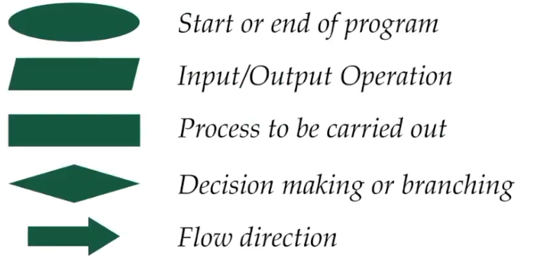
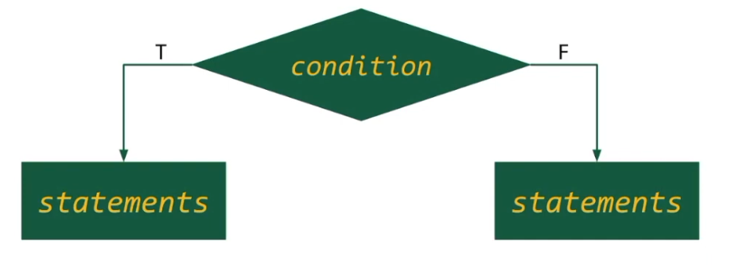
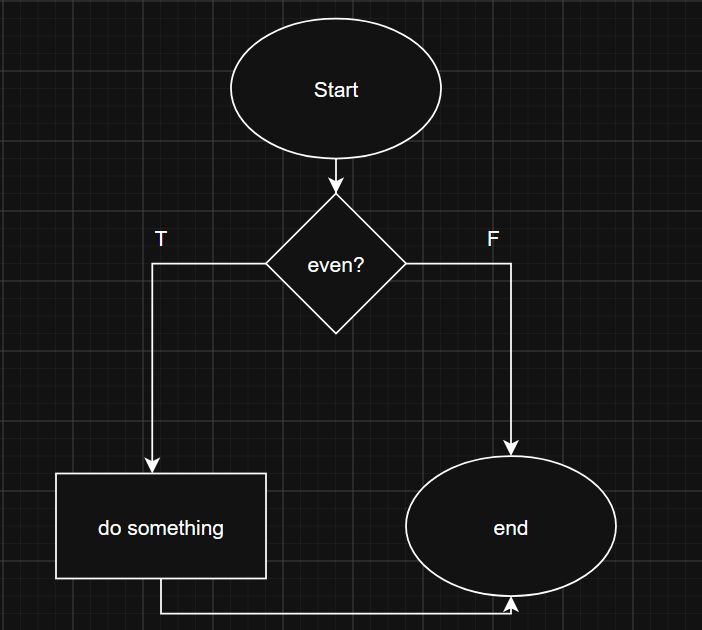
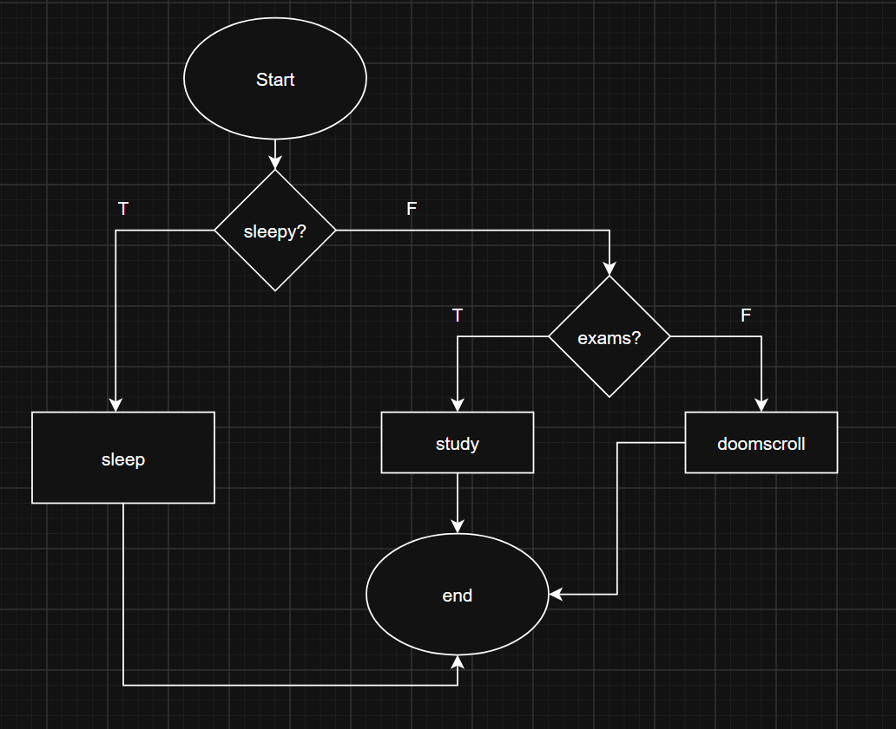
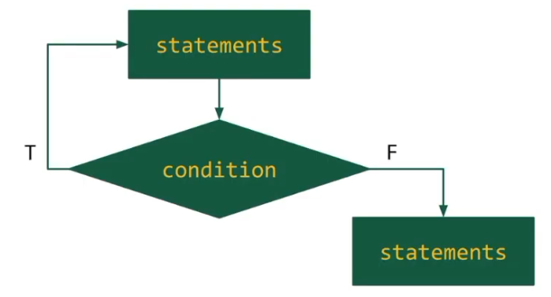
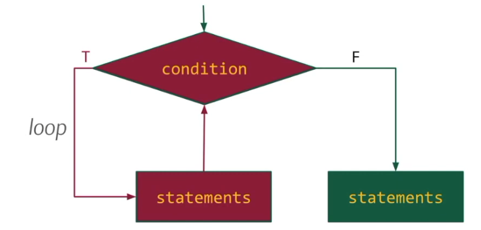
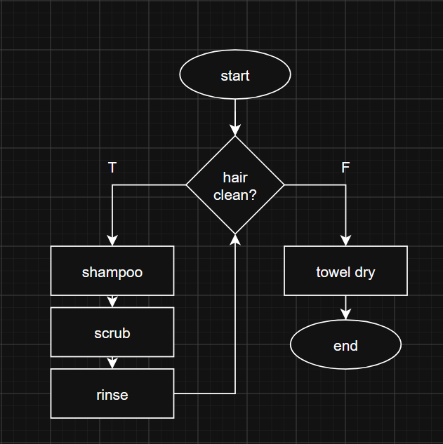

# Intro to Algorithms

**Algorithm**: A **finite** set of **instructions** that specify a **sequence** of operations to be carried out in order **to solve a problem**. (CMSC12 Reviewer, UPLB COSS)

Basically, to **solve** a **problem**, we must use an **algorithm** or a set of **instructions**. **Finite** clarifies that you can't just have a set of instructions of **infinite** length, and **sequence** clarifies that the **operations** must be carried out **in order**.

**Properties of Algorithms**
1. **Finiteness**, meaning the algorithm must end after a finite number of operations.
2. **Absence of Ambiguity**, instructions are clearly and strictly defined, ensuring deterministic behavior.
3. **Defined Sequence**, Each step must have a **well-established structure** on terms of the **order of execution**.
4. **Input-Output definition**, The input accepted and the output returned must be well defined.

___

## Algorithm Representation

There are two ways of representing **algorithms**.
1. **Flowchart** (graphical)
2. **Pseudocode** (textual)
### Flowchart

This method of representing algorithms uses symbols to visually draw out the flow of operations.

It uses these symbols:



### Pseudocode

This is method uses text to represent the algorithm. Since it isn't yet a implementation using a programming language, you can write instructions in any way you wish.

___

## Sequence Control

**Algorithms** follow certain **control structures**.
1. **Sequential**
2. **Selection**
3. **Iterative**

### Sequential

Statements are performed in a given order that only travels one way, meaning a sequential control structure is always linear.

```
Ex. MORNING ROUTINE

1. Wake up
2. Eat food
3. Shower
4. Get dressed
5. Brush teeth
```
*Di ko na gagawan ng flowchart marunong na kayo nyan guys*

### Selection

Selection evaluates a certain condition first and the order of instructions might differ depending on the truth value.

In **flowcharts**, the **diamond** is used for conditions. (di daw rhombus yan)



There are additional intricacies to a condition. Further discussion will assume that the condition is a **true/false condition**.

Conditions can have **empty** branches. For example, if I had a simple program that would only run something when it returns true, the flowchart can simply point straight to end on the false branch.

For example,
```
if x is even:
	do something;
```
would be represented as:



Conditions can be **nested** as well (formally defined as "a branch can have another selection" in 01.3). Take this example:

```
if sleepy:
	sleep;
else:
	if exams_tomorrow:
		study;
	else:
		doomscroll;
```



### Iterative

Iterative sequences execute statements as long as the condition remains **true**.

In a **flowchart**, this is what **iteration** would look like.



**or**



The **algorithm** will return to previous instructions and **loop**, only yielding control to the **false branch** when the **condition** is **no longer** satisfied. This is also why these are commonly referred to as loops.

For example, to wash your hair:

```
wet_hair;

while (hair_is_dirty)
	shampoo;
	scrub;
	rinse;
	
towel_dry;
```

